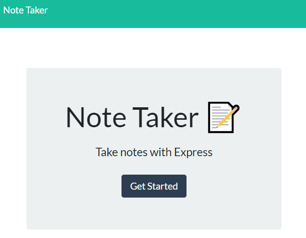

# Digital and Intuitive Note Taking Application

[](https://opensource.org/licenses/MIT)

## **Description**

The purpose of this project was to create a note taking application that uses an Express.js back-end to retrieve and append note data. New notes have both a title and a text body. Additionally, users have the ability to save as well as delete their notes if they so choose.

Click on the following link to be redirected to the application: https://floating-ridge-18223.herokuapp.com/

GitHub repo link: https://github.com/luccaloopz/note-taker

## **Technologies**

* 
* 
* 
* 
* 
* 

## **Application**

The below screenshot shows what the landing page looks like.



Here is what the notes page looks like.


## **Important Code Snippet**

The below snippet instructs the server to grab the new note that the user wrote and to push it to array of note objects in the db.json file. Then, it takes the new note object and uses the res object to send it back to the client.

```JavaScript
const notes = require('express').Router();

notes.post('/', (req,res) => {
    console.info(`${req.method} request received to add a new note`);

    const { title, text } = req.body;

    if (title && text) {
        const newNote = {
            title,
            text,
            id: uuidv4(),
        };

        fs.readFile("./db/db.json", "utf8", (err, data) => {
            if (err) {
                console.log(err);
            } else {
                const parsedNote = JSON.parse(data);
                parsedNote.push(newNote);
                dbNotes = parsedNote;
                fs.writeFile("./db/db.json", JSON.stringify(parsedNote, null, 4), (err) => 
                    err ? console.err(err) : console.log(`New note for ${newNote.title} has been written to the JSON file`)
                );
            };
        });

        const response = {
            status: 'Success',
            body: newNote,
        };

        console.log(response);
        res.json(response);
    } else {
        console.log("Error in posting a new note");
    };
});
```

## **License**
The following application is covered under the MIT License.